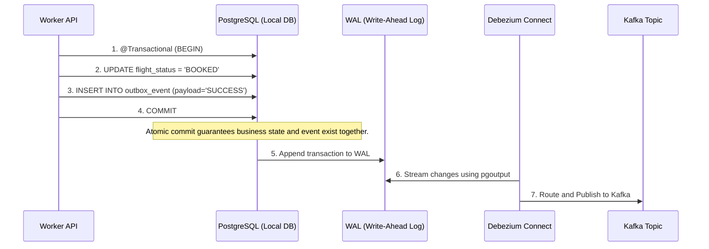
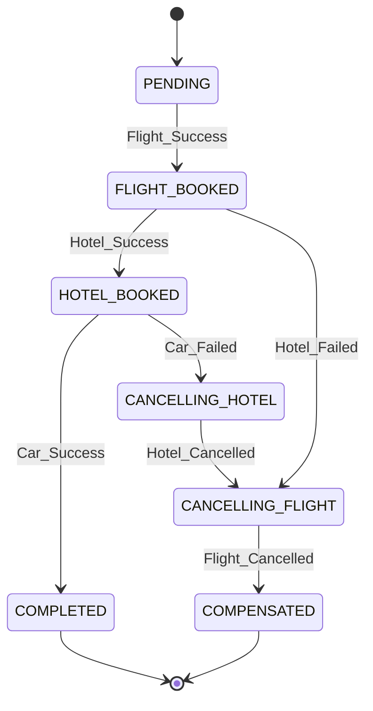

# Distributed Saga Orchestrator Architecture

Architectural overview of the Distributed Saga Orchestrator. This system manages long-running, distributed transactions across multiple independent microservices using the Orchestration-based Saga pattern, ensuring eventual consistency without synchronous two-phase commits (2PC).

## 1. System Context

The system consists of:
- **Orchestrator Service**: The central brain. Uses Spring State Machine to track the lifecycle of a Saga.
- **Worker Services (Flight, Hotel, Car)**: Independent microservices that perform local transactions and emit events.
- **Apache Kafka**: The event bus used for asynchronous communication.
- **PostgreSQL**: Local databases for each service.
- **Debezium**: Change Data Capture (CDC) platform to stream WAL changes directly to Kafka, ensuring **Deterministic State Transitions**.
- **Redis**: Used by the Orchestrator for distributed concurrency locking.

## 2. The Transactional Outbox Pattern (CDC Streaming)

A common anti-pattern in distributed systems is the "Dual Write" problem—attempting to commit to a database and publish to Kafka in the same method. If the database commits but Kafka is down, the system is permanently inconsistent.

This project solves this using the **Transactional Outbox Pattern with Debezium**.

### Outbox Flow Diagram

## 3. Saga Orchestration Flow

When a booking request is initiated, the Orchestrator Service drives the workflow. If any service fails, the Orchestrator issues compensating commands (e.g., `CANCEL_FLIGHT`) to rollback the distributed transaction.

### State Machine Diagram

## 4. Idempotency and Error Handling

To ensure that Sagas scale horizontally and maintain resilience:
1. **Redis Distributed Locks**: The Orchestrator uses `@DistributedLock` via Redisson to ensure that if multiple pods receive the same Kafka message simultaneously, only one instance transitions the State Machine.
2. **UUID Event IDs**: Outbox events use a uniquely generated `eventId` to prevent constraint violations and ensure strict structural uniqueness without relying on multi-column constraints.
3. **Deterministic DLQ Routing**: Kafka consumers explicitly differentiate between transient exceptions (e.g., DataAccess exceptions) and deterministic exceptions (e.g., `IllegalArgumentException`). Transient errors trigger an exponential backoff retry via Spring Kafka `@RetryableTopic`, while persistent errors invoke an embedded `@DltHandler` to instantly route to a Dead Letter Queue and rollback the Saga.

## 5. Architectural Decisions (ADRs)

### ADR 001: Debezium CDC Streaming over Scheduled Polling
* **Context**: The outbox table needs to be monitored for newly inserted events and pushed to Kafka.
* **Decision**: We utilize Debezium Kafka Connect to stream the PostgreSQL Write-Ahead Log (WAL) instead of a scheduled application-level polling mechanism (e.g., `@Scheduled` `SELECT * FROM outbox_event`).
* **Consequences**: This ensures **Infrastructure-level Isolation**, eliminates database CPU spiking caused by constant polling, removes lock contention, and provides sub-millisecond event streaming. It solves the "Dual-Write" problem by delegating event propagation to the log-level capture layer.

### ADR 002: Strict Dead Letter Queue (DLQ) Segregation
* **Context**: Message deserialization or missing data can cause consumers to fail.
* **Decision**: Implement `@RetryableTopic` with explicit `exclude` lists for deterministic errors like `IllegalArgumentException` and `NullPointerException`.
* **Consequences**: Prevents "poison pill" messages from infinitely blocking a topic partition. Transient issues are retried intelligently, while broken messages are sequestered immediately.

### ADR 003: Logical Schema Isolation
* **Context**: Microservices should not share a database to prevent tight coupling, but running 4 separate PostgreSQL instances consumes too much memory for local development and CI/CD.
* **Decision**: Use a single physical PostgreSQL cluster but provision logical isolation via individual schemas (`flight_schema`, `hotel_schema`, etc.) dynamically during container startup.
* **Consequences**: This achieves the architectural boundary goals of a microservice architecture while maintaining low infrastructure overhead and allowing a single Debezium connector to monitor all tables.

### ADR 004: Resilience4j Circuit Breakers for Synchronous Mocks
* **Context**: Worker services often need to call external HTTP APIs synchronously (e.g., Hotel Inventory System).
* **Decision**: We utilize `io.github.resilience4j`'s `@CircuitBreaker` annotation around simulated external calls.
* **Consequences**: Instead of blocking threads and draining the Kafka consumer thread pool during external outages, the circuit breaker fails fast and allows the Saga orchestrator to swiftly issue compensating transactions.

## 6. Key Technologies
- **Java 21 & Spring Boot 3.4**: Core framework.
- **Spring State Machine**: For declarative Saga orchestration.
- **Apache Kafka & Debezium**: Asynchronous streaming and CDC outbox.
- **Redisson**: Redis-backed distributed locking.
- **Resilience4j**: Circuit breaking and fault tolerance.
- **Testcontainers**: Used heavily for high-concurrency integration testing.
