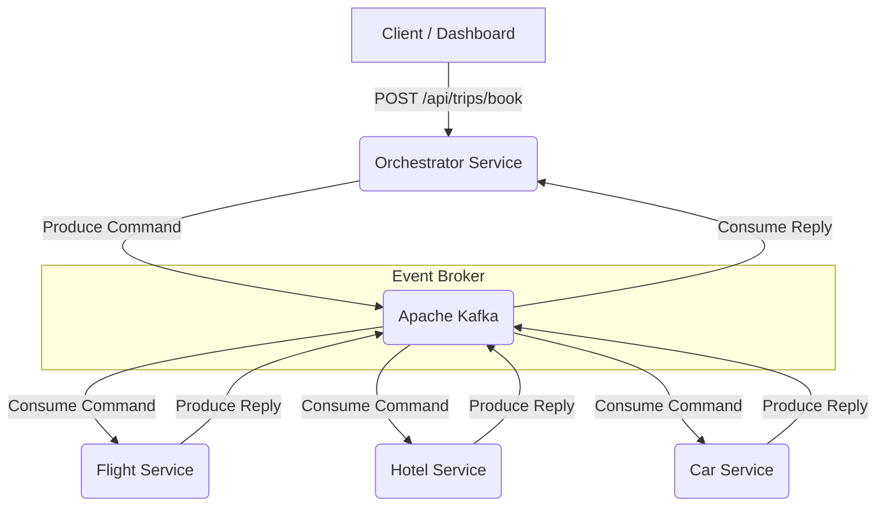

# Distributed Saga Orchestrator

> A resilient multi-module Spring Boot orchestrator that implements the Saga Orchestration pattern with Apache Kafka to guarantee distributed transaction consistency and automated rollbacks across microservices.

[](https://github.com/AbdennasserBentaleb/distributed-saga-orchestrator/actions/workflows/ci.yml)
[](https://openjdk.org/projects/jdk/21/)
[](https://spring.io/projects/spring-boot)
[](LICENSE)

A multi-service Spring Boot application implementing the **Saga Orchestration Pattern** for distributed transaction management in a travel booking domain. The system coordinates flight, hotel, and car reservations and guarantees eventual data consistency through automated compensating transactions when any step fails.

## High-Level Architecture

The system utilizes the Saga Orchestration pattern with Kafka as the event broker.



## Tech Stack

- **Core**: Java 21, Spring Boot 3.4.x
- **Event Streaming**: Apache Kafka, Zookeeper
- **Database**: PostgreSQL 15
- **CDC Streaming**: Debezium Connect
- **Containerization**: Docker, Docker Compose (Multi-stage builds)
- **Deployment**: Kubernetes
- **Observability**: Zipkin, OpenTelemetry, Micrometer
- **Frontend**: Vue 3, Vite

## Architecture Decisions & Trade-offs

### Why Kafka over RabbitMQ

Kafka was chosen primarily because its durable, replayable log is a natural fit for Saga choreography. If the Orchestrator crashes mid-workflow, it can replay its consumer group's committed offsets on restart and resume state transitions from exactly where it left off — a property RabbitMQ's transient queues do not provide without additional infrastructure. The trade-off is Kafka's operational footprint: running Zookeeper alongside the broker is heavyweight relative to a simple AMQP broker, and it would be over-engineered for a system that only needs to process a few thousand bookings per day.

### Distributed Data Consistency (Transactional Outbox & CDC)

A critical anti-pattern in distributed systems is the "Dual-Write" problem—attempting to commit to a database and publish to a message broker in a single transaction. This system solves this using the **Transactional Outbox Pattern** combined with **Change Data Capture (CDC)** via **Debezium**. Instead of publishing directly to Kafka, services write events to an `outbox_event` table within their local schema boundary. Debezium tails the PostgreSQL Write-Ahead Log (WAL) and publishes these outbox events to Kafka, providing **At-Least-Once delivery semantics** with **Consumer-Side Idempotency**. This ensures system-wide consistency without the overhead and complexity of distributed transactions (2PC).

### Orchestration State Machine

The orchestration logic is implemented using **Spring State Machine**. Instead of complex, brittle `if/else` conditional chains, the orchestrator explicitly maps states (e.g., `FLIGHT_BOOKED`, `CANCELLING_HOTEL`) and triggers native `Action` classes upon state transitions. This creates a predictable, highly cohesive, and deterministic transaction coordinator.

### Database Schema Isolation

To maintain strict microservice boundaries while minimizing infrastructure costs and connection overhead, the system uses **Logical Schema Isolation** within a single PostgreSQL cluster. Each service connects only to its assigned schema (`flight_schema`, `hotel_schema`, etc.). This enforces data sovereignty without the complexity of managing multiple physical database clusters, while still allowing Debezium to stream from a single connection.

### Consumer Resiliency and Dead Letter Queues (DLQ)

Handling poison pill messages and consumer group rebalance storms requires resilient consumer design. We implemented a strict routing strategy using Spring Kafka's `@RetryableTopic`. Transient exceptions undergo exponential backoff, while persistent failures are routed to a local `@DltHandler` which writes a `FAILED` event to the outbox. This ensures a single broken message cannot block partition processing or swallow errors silently.

### External System Resiliency (Circuit Breakers)

Synchronous calls to external third-party systems (e.g., legacy hotel inventory APIs) are protected using **Resilience4j Circuit Breakers**. If an external system degrades, the circuit breaker opens, failing fast and immediately triggering a localized rollback without exhausting threads or blocking the orchestrator's event loop.

### Handling Stale States (Service Timeouts)

A major risk in distributed sagas is the "Silent Failure"—where a downstream service never replies, leaving a saga in a non-terminal state. This system implements a **StuckSagaSweeper** (scheduled task) that identifies sagas stuck in `PENDING` or intermediate states beyond a 5-minute TTL. The sweeper injects synthetic failure events into the orchestrator, forcing the state machine to initiate the compensation chain and ensure eventual system-wide consistency even during complete network partitions.

### Database-Level Idempotency & Concurrency

A major challenge in distributed sagas is handling duplicate messages (at-least-once delivery semantics). To guarantee idempotency, we employ a "Defense in Depth" strategy:

First, we utilize **Redis Distributed Locks** as a fast-fail mechanism. When a Kafka consumer receives a message, it attempts to acquire a lock using the saga ID. If the lock is already held, the consumer drops the duplicate message immediately. This layer protects the database connection pool from thundering herd problems.

Second, the structural guarantee is provided by UUID `event_id` primary keys in the Outbox tables. This ensures even if two distinct events are generated for the same saga concurrently, they are processed immutably and deterministically without unique constraint collisions.

## Production Bottlenecks (Scale Ceiling)

While this architecture is robust, the current implementation has several bottlenecks that would need to be addressed for true high-scale production loads:

- **Single-broker Kafka**: The `docker-compose` stack runs a single-partition, single-replica broker. In production, a multi-node Kafka cluster with a replication factor of at least 3 is required to survive broker failures.
- **Database Connection Scaling**: Each service maintains its own connection pool directly to PostgreSQL. Under heavy horizontal scaling, the aggregate number of connections would quickly exhaust the database's `max_connections`. A connection multiplexer like **PgBouncer** is necessary to handle thousands of concurrent service instances.
- **State Machine Persistence**: Currently, Spring State Machine state is persisted synchronously. At extreme throughput, the database overhead for state transitions would become the primary latency driver. Moving to an event-sourced state storage or a specialized workflow engine (like Temporal) would be the next evolutionary step.
- **Direct DB Connection Pools**: The current setup uses direct HikariCP pools. In a high-concurrency Staff-level environment, we would prioritize **Infrastructure-level Isolation** by moving to dedicated DB instances per service rather than logical schema isolation.

Product requirements and domain definitions are in [`docs/PRD.md`](docs/PRD.md).

## Running Locally

### Prerequisites

- Java 21
- Docker and Docker Compose

### 1. Build and Start the Stack

The project uses multi-stage Dockerfiles. It compiles the Java services directly inside the container during the build phase. You do not need Maven installed on your host system.

This single command brings up PostgreSQL, Zookeeper, Kafka, Zipkin, four Spring Boot services, and the Vue dashboard:

```bash
docker-compose up -d --build
```

Allow 30 to 45 seconds for Kafka and the Spring Boot contexts to initialize before sending requests. You can monitor readiness via the health endpoint:

```bash
curl http://localhost:8085/actuator/health/readiness
```

### 3. Access the Dashboard

The Vue dashboard is available at `http://localhost:3000`.

It provides three views:
- **Overview** — live saga statistics, polled every 3 seconds
- **Book a Trip** — submit a new booking and receive the returned saga ID
- **Recent Trips** — the 20 most recent saga records with status badges

### 4. Observability

Zipkin distributed tracing is available at `http://localhost:9411`. OpenTelemetry W3C trace context is injected into Kafka message headers, giving end-to-end span visibility across all four services within a single trace.

## API Reference

All endpoints are served by the Orchestrator Service on port `8085`.

| Method | Path | Description |
|---|---|---|
| `POST` | `/api/trips/book` | Start a new saga. Body: `{ "customerId", "flightDetails", "hotelDetails", "carDetails" }`. Returns `202 Accepted` with the saga ID. |
| `GET` | `/api/trips/audit` | Returns a status count summary: `{ "COMPLETED": n, "COMPENSATED": n, "TOTAL_REQUESTS": n }`. |
| `GET` | `/api/trips/recent` | Returns the 20 most recent saga records ordered by creation time. |

## End-to-End Simulation

The `simulation/` directory contains a Python script that fires 1,000 asynchronous booking requests against the orchestrator. It intentionally injects a 20% failure rate into the Car Service to exercise the rollback path under load.

```bash
cd simulation
pip install aiohttp requests
python simulate_bookings.py
```

After all requests are dispatched, the script waits 15 seconds for Kafka events to settle (the eventual consistency window) and then queries the audit endpoint. With 1,000 requests and a 20% car failure rate, you should see approximately 800 completed sagas and 200 fully compensated sagas. Any saga not in a terminal state (`COMPLETED` or `COMPENSATED`) is reported as a warning and should be investigated in Zipkin.

## Kubernetes Deployment

Kubernetes manifests are in `k8s/`. With a local cluster (Minikube or Docker Desktop):

```bash
kubectl apply -f k8s/
```

Each deployment manifest includes:
- `runAsNonRoot: true` and `runAsUser: 65532` at the pod security context level
- `readOnlyRootFilesystem: true` and `capabilities: drop: [ALL]` at the container level
- A `/tmp` volume mount to satisfy Spring Boot's temporary file needs with a read-only root FS
- `livenessProbe` and `readinessProbe` mapped to `/actuator/health/liveness` and `/actuator/health/readiness` respectively

> **Note for local Minikube users**: The manifest images reference `AbdennasserBentaleb/saga-*-service:1.0.0` with `imagePullPolicy: Never`. Build the images locally first and load them into your cluster: `minikube image load AbdennasserBentaleb/saga-orchestrator-service:1.0.0` (repeat for each service).

## Running the Tests

```bash
# Unit tests only (Lightning fast, no Docker required)
mvn clean test

# All tests (Unit + Testcontainers integration tests)
mvn clean verify -P integration
```

The test suite includes:
- **Unit tests** (Mockito) in all four modules, covering happy paths, idempotency guards, and compensating transaction logic.
- **Integration tests** (`*IT`) using Testcontainers to spin up real Kafka and PostgreSQL instances and verify Spring context wiring.
- **Concurrency tests** (`SagaConcurrencyIT`) — 50 threads release simultaneously via a `CountDownLatch` to verify that concurrent `startSaga()` calls produce no deadlocks, data corruption, or cross-thread state leakage. The test is annotated `@RepeatedTest(3)` to surface non-deterministic race conditions.

## License

MIT
