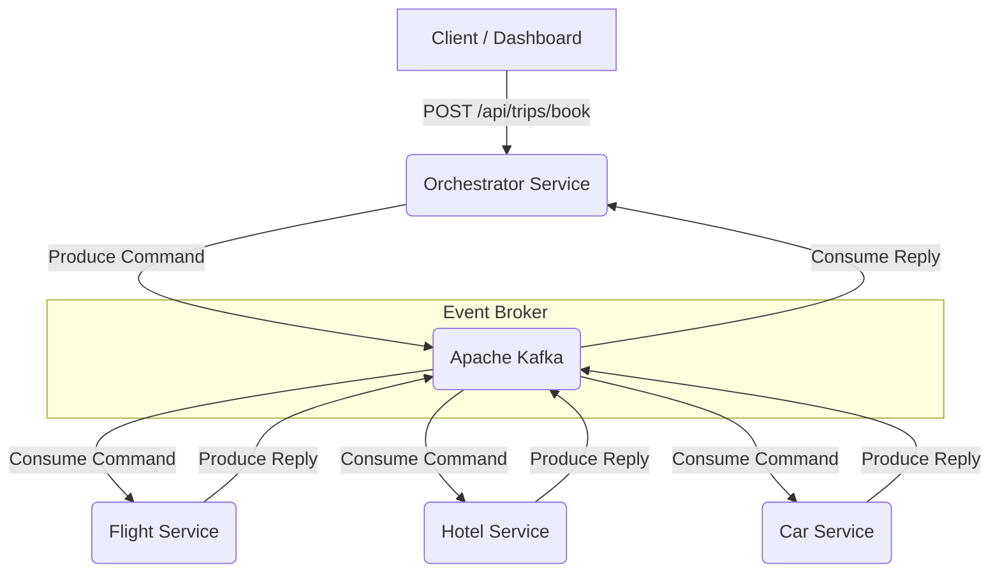

# Distributed Saga Orchestrator

A cloud-native microservices system implementing the **Saga Orchestration Pattern** for distributed transaction management across a travel booking domain. The system coordinates flight, hotel, and car rental bookings as a single logical unit, guaranteeing data consistency through automated compensating transactions when any step in the workflow fails.

## What This Project Demonstrates

**Orchestration-Based Saga Pattern:**
A central Orchestrator Service owns the full transaction state machine. It drives the booking workflow forward by issuing commands to downstream services and, on any failure, triggers compensating transactions in reverse order to roll back previously completed work.

**Event-Driven Architecture:**
All inter-service communication is asynchronous via Apache Kafka. Services are fully decoupled and can fail and restart independently without causing data loss or inconsistency.

**Database per Service:**
Each microservice owns its own isolated PostgreSQL schema. Schema changes within one service are entirely invisible to others, enforcing strict bounded context separation.

**Idempotent Message Handling:**
Services check whether a booking already exists for a given Saga ID before processing. Duplicate message deliveries from Kafka do not create duplicate records.

**Distributed Tracing:**
OpenTelemetry W3C trace context is propagated through Kafka message headers, giving end-to-end visibility across all four services in Zipkin.

**Kubernetes-Ready Deployment:**
Each service ships with a multi-stage Dockerfile based on Eclipse Temurin Alpine JRE and a set of Kubernetes manifests covering Deployments, Services, and Ingress.

## System Architecture

Architecture decisions, data flow diagrams, and technical trade-off analysis are documented in [`docs/System_Architecture.md`](docs/System_Architecture.md). Product requirements are in [`docs/PRD.md`](docs/PRD.md).



## Running Locally

### Prerequisites

- Java 21
- Docker and Docker Compose

### 1. Build All Services

From the project root, compile the entire multi-module Maven project. Tests are skipped here for a faster build.

```bash
./mvnw clean package -DskipTests
```

### 2. Start the Stack

This brings up PostgreSQL, Zookeeper, Kafka, Zipkin, all four Spring Boot services, and the Vue dashboard.

```bash
docker-compose up -d --build
```

Allow 30 to 45 seconds for Kafka and the Spring Boot contexts to fully initialize before sending requests.

### 3. Access the Dashboard

The Vue dashboard is available at `http://localhost:3000`. It provides three views:

- **Overview** — live saga statistics updated every 3 seconds
- **Book a Trip** — submit a new booking request and see the returned saga ID
- **Recent Trips** — the 20 most recent saga records with status badges

### 4. Check the Observability Layer

Zipkin distributed tracing is available at `http://localhost:9411`.

## API Reference

All endpoints are served by the Orchestrator Service.

| Method | Path | Description |
|---|---|---|
| `POST` | `/api/trips/book` | Start a new saga. Body: `{ "customerId", "flightDetails", "hotelDetails", "carDetails" }`. Returns `202 Accepted` with the saga ID. |
| `GET` | `/api/trips/audit` | Returns a status count summary: `{ "COMPLETED": n, "COMPENSATED": n, "TOTAL_REQUESTS": n }`. |
| `GET` | `/api/trips/recent` | Returns the 20 most recent saga records ordered by creation time. |

## End-to-End Simulation

The `simulation/` directory contains a Python script that fires 1,000 asynchronous booking requests against the orchestrator. It intentionally injects a 20% failure rate into the Car Service to exercise the rollback path under load.

```bash
cd simulation
pip install aiohttp requests
python simulate_bookings.py
```

At the end of the run the script queries the databases directly and prints a consistency report. With 1,000 requests and a 20% car failure rate, you should see approximately 800 completed sagas and 200 fully compensated sagas, with zero stuck or inconsistent records.

## Kubernetes Deployment

Kubernetes manifests are provided in the `k8s/` directory. With a local cluster (Minikube or Docker Desktop):

```bash
kubectl apply -f k8s/
```

## Running the Tests

```bash
./mvnw test
```

All four modules have JUnit 5 unit tests written with Mockito. The tests cover the happy path, the idempotency guard, and the compensating transaction logic.

## License

MIT
