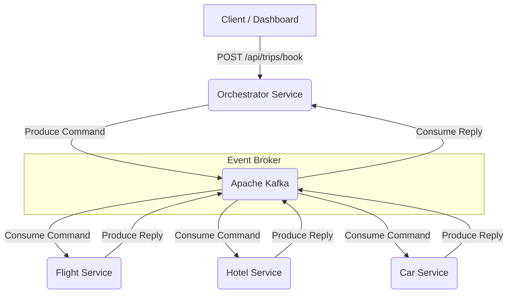

# Distributed Saga Orchestrator

A multi-service Spring Boot application implementing the **Saga Orchestration Pattern** for distributed transaction management in a travel booking domain. The system coordinates flight, hotel, and car reservations and guarantees eventual data consistency through automated compensating transactions when any step fails.

## Architecture Decisions & Trade-offs

Distributed systems demand explicit choices. Here is what was decided and why, along with honest acknowledgements of what this design does not provide.

### Why Kafka over RabbitMQ

Kafka was chosen primarily because its durable, replayable log is a natural fit for Saga choreography. If the Orchestrator crashes mid-workflow, it can replay its consumer group's committed offsets on restart and resume state transitions from exactly where it left off — a property RabbitMQ's transient queues do not provide without additional infrastructure. The trade-off is Kafka's operational footprint: running Zookeeper alongside the broker is heavyweight relative to a simple AMQP broker, and it would be over-engineered for a system that only needs to process a few thousand bookings per day.

### Orchestration over Choreography

An orchestration-based approach was chosen over an event-driven choreography approach. In choreography, each service reacts to domain events published by the previous step without any central coordinator. This is harder to reason about at scale because the implicit transaction state is spread across multiple Kafka topics and cannot be queried in one place. With the orchestrator owning the full state machine and persisting a `SagaState` record, the current status of any transaction is always one SQL query away.

### Java GC Pauses in a High-Throughput Context

The JVM's stop-the-world GC cycles introduce non-deterministic latency spikes under load. For a travel booking system, the acceptable latency budget per request is in the hundreds of milliseconds, so G1GC tuning is sufficient. If this were a high-frequency trading or real-time bidding engine, the saga logic would need to be extracted into a native binary (Rust or C++) or the JVM would need careful ZGC/Shenandoah configuration to bound max pause times. That tuning is not performed here because it is outside the scope of the use case.

### Consumer Group Rebalances

A non-obvious production challenge encountered during development was Kafka consumer group rebalance storms. When multiple orchestrator instances start simultaneously (e.g., after a rolling deployment), Kafka triggers group rebalances that briefly pause all consumers. Combined with Spring Kafka's default `LATEST` offset strategy, this can cause events to be dropped if a message is produced during the rebalance window. This was addressed by configuring `auto-offset-reset: earliest` and relying on idempotency checks to safely reprocess any re-delivered events.

### Current Limitations

- **No Timeout / Saga Expiry**: If a downstream service never replies (e.g., network partition to the Car Service), the Saga will remain permanently in a `HOTEL_BOOKED` state. A production implementation would need a scheduled cleanup job or a Kafka Streams windowed aggregator to detect and compensate stuck sagas after a configurable TTL.
- **Single-broker Kafka**: The `docker-compose` stack runs a single-partition, single-replica broker with `replication.factor=1`. This is acceptable for local development but would not survive a broker restart in a real cluster.
- **Database Scaling**: Each service maintains its own connection pool directly to PostgreSQL. Under horizontal scaling, this exhausts database connections quickly. A connection multiplexer (PgBouncer) would be the correct next step.

Product requirements and domain definitions are in [`docs/PRD.md`](docs/PRD.md).



## Running Locally

### Prerequisites

- Java 21
- Docker and Docker Compose

### 1. Build All Services

From the project root, build the entire multi-module Maven project. Tests are skipped here to keep the initial build fast.

```bash
./mvnw clean package -DskipTests
```

### 2. Start the Stack

This brings up PostgreSQL, Zookeeper, Kafka, Zipkin, four Spring Boot services, and the Vue dashboard in one command.

```bash
docker-compose up -d --build
```

Allow 30 to 45 seconds for Kafka and the Spring Boot contexts to initialize before sending requests. You can monitor readiness via the health endpoint:

```bash
curl http://localhost:8085/actuator/health/readiness
```

### 3. Access the Dashboard

The Vue dashboard is available at `http://localhost:3000`.

It provides three views:
- **Overview** — live saga statistics, polled every 3 seconds
- **Book a Trip** — submit a new booking and receive the returned saga ID
- **Recent Trips** — the 20 most recent saga records with status badges

### 4. Observability

Zipkin distributed tracing is available at `http://localhost:9411`. OpenTelemetry W3C trace context is injected into Kafka message headers, giving end-to-end span visibility across all four services within a single trace.

## API Reference

All endpoints are served by the Orchestrator Service on port `8085`.

| Method | Path | Description |
|---|---|---|
| `POST` | `/api/trips/book` | Start a new saga. Body: `{ "customerId", "flightDetails", "hotelDetails", "carDetails" }`. Returns `202 Accepted` with the saga ID. |
| `GET` | `/api/trips/audit` | Returns a status count summary: `{ "COMPLETED": n, "COMPENSATED": n, "TOTAL_REQUESTS": n }`. |
| `GET` | `/api/trips/recent` | Returns the 20 most recent saga records ordered by creation time. |

## End-to-End Simulation

The `simulation/` directory contains a Python script that fires 1,000 asynchronous booking requests against the orchestrator. It intentionally injects a 20% failure rate into the Car Service to exercise the rollback path under load.

```bash
cd simulation
pip install aiohttp requests
python simulate_bookings.py
```

After all requests are dispatched, the script waits 15 seconds for Kafka events to settle (the eventual consistency window) and then queries the audit endpoint. With 1,000 requests and a 20% car failure rate, you should see approximately 800 completed sagas and 200 fully compensated sagas. Any saga not in a terminal state (`COMPLETED` or `COMPENSATED`) is reported as a warning and should be investigated in Zipkin.

## Kubernetes Deployment

Kubernetes manifests are in `k8s/`. With a local cluster (Minikube or Docker Desktop):

```bash
kubectl apply -f k8s/
```

Each deployment manifest includes:
- `runAsNonRoot: true` and `runAsUser: 65532` at the pod security context level
- `readOnlyRootFilesystem: true` and `capabilities: drop: [ALL]` at the container level
- A `/tmp` volume mount to satisfy Spring Boot's temporary file needs with a read-only root FS
- `livenessProbe` and `readinessProbe` mapped to `/actuator/health/liveness` and `/actuator/health/readiness` respectively

> **Note for local Minikube users**: The manifest images reference `AbdennasserBentaleb/saga-*-service:1.0.0` with `imagePullPolicy: Never`. Build the images locally first and load them into your cluster: `minikube image load AbdennasserBentaleb/saga-orchestrator-service:1.0.0` (repeat for each service).

## Running the Tests

```bash
./mvnw test
```

The test suite includes:
- **Unit tests** (Mockito) in all four modules, covering happy paths, idempotency guards, and compensating transaction logic.
- **Integration tests** (`OrchestratorIntegrationTest`) using Testcontainers to spin up real Kafka and PostgreSQL instances and verify Spring context wiring.
- **Concurrency tests** (`SagaConcurrencyIntegrationTest`) — 50 threads release simultaneously via a `CountDownLatch` to verify that concurrent `startSaga()` calls produce no deadlocks, data corruption, or cross-thread state leakage. The test is annotated `@RepeatedTest(3)` to surface non-deterministic race conditions.

## License

MIT
