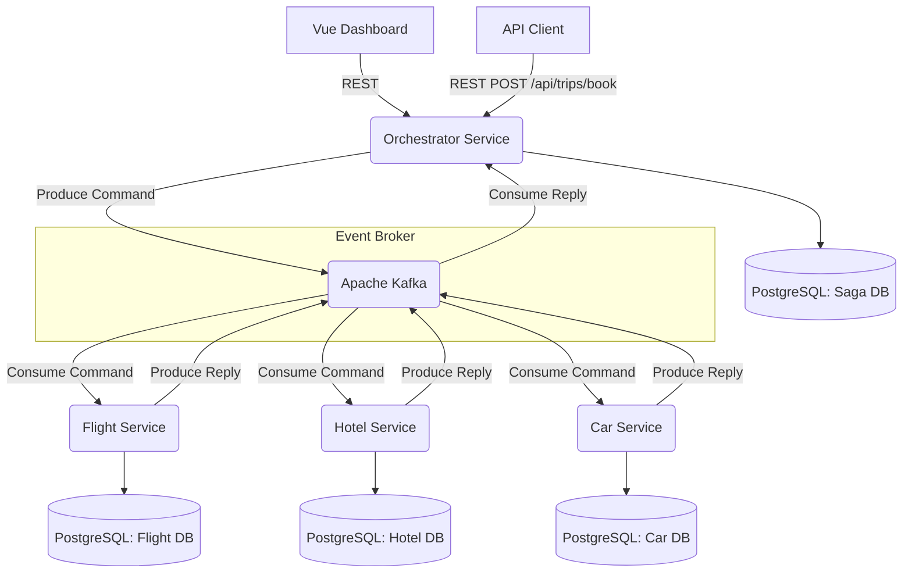

# System Architecture

## 1. High-Level Overview

This system is structured as a set of independently deployable microservices that together implement a travel booking workflow. A client submits a single booking request, and the system coordinates reservations across three domain services: Flight, Hotel, and Car Rental. An operational dashboard provides a real-time view of saga state.

Because each service owns its own database, they cannot participate in a shared ACID transaction. The Saga Pattern addresses this by decomposing the distributed transaction into a sequence of local transactions, with compensating transactions defined for each step to handle failures.

## 2. Technical Decisions and Trade-offs

### 2.1 Orchestrated Saga vs. Choreographed Saga

**Decision:** Orchestrated Saga.

A centralized Orchestrator Service manages the saga's state machine. The orchestration approach was chosen over choreography because the booking workflow involves multiple sequential steps with clear dependencies. In a choreographed design, each service would need awareness of the full workflow state, which creates implicit coupling and makes failure diagnosis substantially harder as the flow scales.

**Trade-off:** The Orchestrator is a single point of failure and adds a network hop. This is mitigated by persisting all saga state to PostgreSQL, keeping the service itself stateless, and making it horizontally scalable behind a load balancer.

### 2.2 Database per Service

**Decision:** Each microservice connects to its own isolated logical database schema within the PostgreSQL instance.

This enforces bounded context separation. The flight service can evolve its schema without coordinating with the hotel or car services. It also means that the only guaranteed interface between services is the Kafka topic contract, not internal data models.

### 2.3 Asynchronous Messaging via Apache Kafka

**Decision:** All commands and events flow through Kafka topics.

Synchronous HTTP between services creates temporal coupling. If the hotel service is unavailable when the orchestrator tries to call it, the saga fails immediately. With Kafka, the command message persists in the topic until the consumer comes back online, making the system resilient to partial outages without requiring explicit retry logic in the producer.

### 2.4 Distributed Tracing with Micrometer and Zipkin

**Decision:** W3C Trace Context headers are injected into Kafka message headers and extracted by consumers.

This propagates a single trace ID across all four services for a given booking request. Without this, correlating log entries across services for a single saga would require querying by saga ID across four separate log streams. Zipkin provides a visual trace timeline that makes the message flow inspectable in one place.

### 2.5 Operational Dashboard

**Decision:** A Vue 3 single-page application serves as a lightweight operational interface.

The dashboard communicates with the Orchestrator's REST API exclusively. It polls `/api/trips/audit` every 3 seconds for aggregate statistics and `/api/trips/recent` every 5 seconds for the live saga table. This polling approach was chosen over WebSocket push because the update frequency requirement is low enough that polling introduces no perceptible latency and requires no additional server-side infrastructure.

The dashboard is served by an nginx container on port 3000 and is built as a multi-stage Docker image.

## 3. Data Flow

### Happy Path

1. The client sends a POST request to the Orchestrator REST API with booking details.
2. The Orchestrator creates a `PENDING` saga record in its database and publishes a `ReserveFlightCommand` to Kafka.
3. The Flight Service consumes the command, creates a flight booking record, and publishes a `FlightReservedEvent`.
4. The Orchestrator receives the event, updates the saga state to `FLIGHT_BOOKED`, and publishes a `ReserveHotelCommand`.
5. The Hotel Service consumes the command, creates a hotel booking record, and publishes a `HotelReservedEvent`.
6. The Orchestrator updates the state to `HOTEL_BOOKED` and publishes a `ReserveCarCommand`.
7. The Car Service successfully reserves and publishes a `CarReservedEvent`.
8. The Orchestrator updates the saga state to `COMPLETED`.

### Compensating Path

If a service fails after earlier steps have already committed:

1. Steps 1 through 6 have completed. Flight and hotel bookings exist in their respective databases.
2. The Orchestrator publishes a `ReserveCarCommand`. The Car Service fails due to insufficient inventory and publishes a `CarFailedEvent`.
3. The Orchestrator receives the failure event and transitions the saga state to `CANCELLING_HOTEL`.
4. It publishes a `CancelHotelCommand`. The Hotel Service cancels its booking and publishes a `HotelCancelledEvent`.
5. The Orchestrator transitions to `CANCELLING_FLIGHT` and publishes a `CancelFlightCommand`.
6. The Flight Service cancels its booking and publishes a `FlightCancelledEvent`.
7. The Orchestrator transitions the saga state to `COMPENSATED`. All three databases are back to their pre-booking state.
